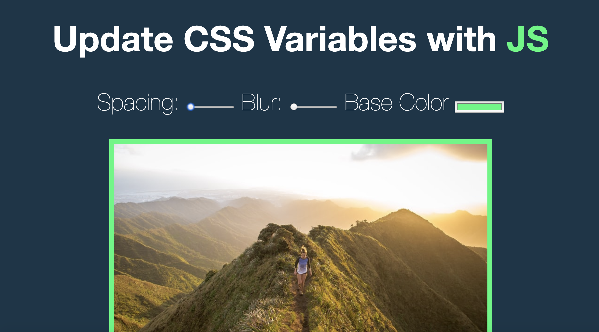

# Update CSS Variables with JS

---

- This small project was inspired from #javascript 30

- Showcase how to create CSS variable to update multiple elements on the page

- used javascript, html, css 

## Installation

1. fork this repository to your own github account or download zip file
2. create local repository on github for your copy of the files
3. open with code editor of your choice
4. type "open -a "Google Chrome" index-luke.html" as terminal command to view 

---
Screen shot
